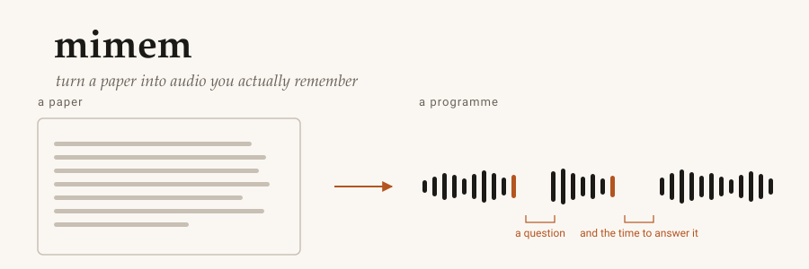
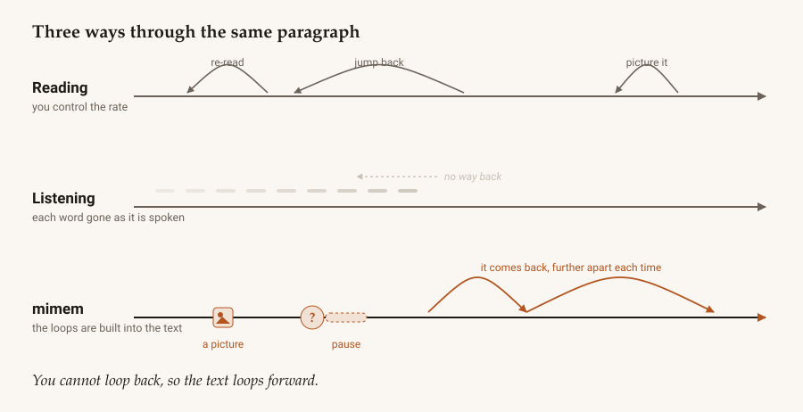
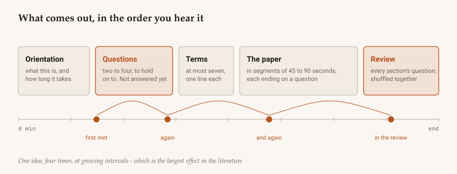

<div align="center">

<picture>
  <source media="(prefers-color-scheme: dark)" srcset="docs/assets/hero-dark.svg">
  
</picture>

<br>

[](https://github.com/jepegit/mimem/actions/workflows/ci.yml)
[](https://jepegit.github.io/mimem/)
[](https://www.python.org/downloads/)
[](https://github.com/astral-sh/ruff)
[](https://mypy-lang.org/)
[](LICENSE)
[](#-help-wanted)

**[Documentation](https://jepegit.github.io/mimem/)** ·
[Try it](#quickstart) ·
[Why it works](https://jepegit.github.io/mimem/science/) ·
[**Help wanted**](#-help-wanted)

</div>

---

You have listened to a whole paper and remembered nothing. That is not a failing of attention. It
is what happens when you take away everything that made reading work, and put **nothing** back.

When you read, you do a dozen things without noticing: you slow down on the hard sentence, re-read
the clause that didn't parse, jump back two pages to recover a definition, stop and build a
picture. Listening removes every one of them — and a text-to-speech engine adds nothing in their
place. It just reads, faster than you can think, through the affiliations, through "open square
bracket twelve", through a four-decimal percentage nobody could hold.

**mimem rewrites the document so the text itself does what a careful reader would have done.**

<div align="center">
<picture>
  <source media="(prefers-color-scheme: dark)" srcset="docs/assets/lanes-dark.svg">
  
</picture>
</div>

---

## Quickstart

**With Claude Desktop**, skip the command line — install
[mimem.mcpb](https://github.com/jepegit/mimem/releases/latest/download/mimem.mcpb) and you can say
*"make me a study programme from this paper"*, then *"quiz me on what's due"* days later. The
assistant writes the explanations too, so no API key is needed.
[Set it up →](https://jepegit.github.io/mimem/listening/assistant/)

**From a terminal:**

```bash
git clone https://github.com/jepegit/mimem.git && cd mimem
```

```bash
uv venv --python 3.13 && uv pip install -e ".[dev,epub]"
```

```bash
uv run mimem build paper.pdf --out out/paper
```

That is the whole pipeline: read the PDF, work out what is worth saying, decide how to say it,
lay it out as a programme, write four files, and check the result against the thirty-two design rules
that can be checked mechanically — of ninety-three the programme is built to. It exits non-zero if it
broke one, so a bad script cannot be produced quietly.

<table>
<tr><td><code>audio.md</code></td><td>What the speech engine says, and nothing else. No digits, no brackets, no citations.</td></tr>
<tr><td><code>study.md</code></td><td>The written companion: the source sentence behind every beat, with its page.</td></tr>
<tr><td><code>cards.json</code></td><td>The questions and answers, each with the span its answer came from.</td></tr>
<tr><td><code>manifest.json</code></td><td>The audit trail: what each idea scored, when you met it, what was cut and why.</td></tr>
</table>

New to this? The [getting started guide](https://jepegit.github.io/mimem/listening/install/) assumes
no Python at all.

---

## What comes out

<div align="center">
<picture>
  <source media="(prefers-color-scheme: dark)" srcset="docs/assets/anatomy-dark.svg">
  
</picture>
</div>

Here is a real sentence from a battery paper, as an engine reads it:

> "Electrolyte decomposition at the negative electrode leads to the formation of a solid
> electrolyte interphase, S E I, which passivates the surface and limits further reduction, Peled
> comma one nine seven nine semicolon Winter et al comma two thousand eighteen. However, the S E I
> is not static: repeated volume changes of the active material during…"

And after mimem has been through it:

> **Part two of five. Why the battery loses capacity even when nothing breaks.**
>
> Here's a question to hold on to: when a silicon anode loses capacity, what is actually being
> consumed? *…pause…*
>
> Two terms first. The electrolyte is the liquid that carries lithium between the two electrodes.
> The S E I — that's the solid electrolyte interphase — is a thin crust that forms on the negative
> electrode during the first few charges.
>
> Here's a way to picture it. A cast-iron pan that seasons itself: the first heating burns a thin
> layer onto the metal, and that burnt layer is what stops the metal rusting further. My analogy,
> not theirs — and it breaks down in one place, which is the whole point of this section: a pan
> doesn't change size. *…pause…*

Nothing there is decoration. Each piece is a rule, and each rule is a finding:

| What you hear | Why it is there |
|---|---|
| A question before the content | Prequestions raise recall of what they point at (*g* ≈ 0.54–0.66) |
| Terms explained before they are used | Meeting a new label and a new mechanism at once overloads working memory |
| A concrete image for an abstract idea | The concreteness effect is among the most replicated findings in memory research |
| Silence after a question | A retrieval attempt needs time to be an attempt |
| Ideas returning at growing intervals | Spacing is the largest effect in the literature (*g* ≈ 0.74) — and audio is worst at it |
| The analogy's limit, said out loud | Otherwise you remember the analogy instead of the concept |

**And nothing invents facts.** Every sentence is either the paper's own — carrying the exact place
it came from — or one of about a dozen named templates. Where a model writes something, every
number in it is checked against the sentences it was written from, and a claim that reverses the
paper's direction is rejected before anyone hears it.

[Read the full worked example →](docs/examples/programme.md)

---

## 🙋 Help wanted

I built this because I wanted it. I read a lot of papers, I listen to a lot of them, and I was
tired of finishing one with nothing to show for it. It works well enough now that I use it — and
it would be considerably better with other people in it.

**Everyone is welcome here.** I mean that in a specific way, not a decorative one:

<table>
<tr>
<td width="25%"><b>Never contributed<br>to anything before</b></td>
<td>Then start here, honestly. Run it on a paper from your field and tell me what came out wrong — a bad sentence, a mangled number, a section it skipped. That is a real contribution and it needs no code. <a href="https://github.com/jepegit/mimem/issues/new">Open an issue</a> and paste what you got.</td>
</tr>
<tr>
<td><b>You write Python</b></td>
<td>The most valuable thing you can add is a <b>lint rule</b> — a rule that is checked is a rule that is real, and about two thirds of the design rules are not checked yet. Adapters for new formats and verbalizers for awkward notation are self-contained too. <a href="https://jepegit.github.io/mimem/building/extending/">How to add one</a>.</td>
</tr>
<tr>
<td><b>You know the<br>learning science</b></td>
<td>Tell me where I have it wrong. Every rule traces to a finding in the <a href="docs/knowledge-base/README.md">knowledge base</a>, with a confidence tag, and I would much rather be corrected than be confidently mistaken in public.</td>
</tr>
<tr>
<td><b>You read papers<br>in another field</b></td>
<td>All of my test material is batteries and electrochemistry. If it falls over on a medical trial, a linguistics paper or an economics preprint, that is a bug I cannot find on my own.</td>
</tr>
<tr>
<td><b>You are an<br>AI agent</b></td>
<td>Also genuinely welcome, and there is <a href="AGENTS.md">a page written for you</a>: the conventions, the traceability rule, and what "done" means here. Say so in the PR, and have a human able to answer questions about it.</td>
</tr>
</table>

Read [**CONTRIBUTING.md**](CONTRIBUTING.md) before your first pull request — it is short, and it
says what I actually care about. The short version: the linter is the acceptance test, every rule
traces to a finding, and comments should record what broke rather than what the code does.

If you are not sure whether an idea is welcome, it is. Open an issue and ask.

---

## Where it is up to

Part 1 — document in, audio out — is built. Part 2 — playback and review across sessions — is not.

| | |
|---|---|
| ✅ **M0–M2** | Ingest, clean, triage, and deterministic verbalizers. Nothing unspeakable survives. |
| ✅ **M3** | Concepts scored by difficulty × importance, shifted by what you already know. |
| ✅ **M4** | The planner: segments, questions, pauses, the spacing scheduler, four artefacts. |
| ✅ **M5** | The optional elaboration layer, and the grounding gate that makes it trustable. |
| ✅ **M6** | The complete lint suite, and an evaluation harness — the first time any of this gets *measured* rather than argued from the literature. |
| ✅ **M7** | The hand-off to a speech engine. `mimem build paper.pdf --speak sapi` ends in a WAV you can play. |
| ✅ **M8** | Reach: one adapter for every OpenAI-shaped server, hosted or local, and `mimem doctor` to say what your machine can actually get to. |
| ✅ **M9** | Both paths: the deterministic pipeline runs as the *control*, not the fallback, and `mimem compare` says what a model was actually worth. |
| ✅ **M10–M12** | Rule enforcement and the rules a critic pass found; more voices, including ElevenLabs, and MP3 when `ffmpeg` is there. |

Two things you should know before trusting it. The **live API adapter has never been run** (there
was no key in the environment it was written in). And the evaluation that now exists is the
mechanical layer only — it measures whether the output still has the properties the design asks
for, *not* whether anyone learned anything; the layers that would answer that need a model and
then people. Both are written down in [the plan](docs/PLAN-part1.md).

`mimem doctor` will tell you which of those paths your machine can currently take, and
[Using a model](https://jepegit.github.io/mimem/ai/) explains each one — including everything
that works with no key at all, which is most of it.

A third, smaller one: the **corpus is one document**. That is enough to catch a verbalizer
regression and not enough to measure spacing, which is why the harness now records how many
concepts each spacing number was averaged over.

What the measuring found immediately, on mimem's own output: **no term is ever defined unless you
turn the elaboration layer on**, and **half the recurring concepts have gaps that shrink rather
than grow**. Neither breaks a rule. Both are now numbers in a file that CI watches.

---

## Documentation

Everything is at **[jepegit.github.io/mimem](https://jepegit.github.io/mimem/)**, built from the
`docs/` directory in this repository.

| | |
|---|---|
| [Listening](https://jepegit.github.io/mimem/listening/) | Install it, run it, tune it to what you already know. No Python needed. |
| [The science](https://jepegit.github.io/mimem/science/) | Why it is built like this — including the findings that did *not* replicate. |
| [Building it](https://jepegit.github.io/mimem/building/) | Architecture, the nine stages, and how to extend each of them. |
| [Design rules](docs/DESIGN-RULES.md) | The ~90 numbered rules the output must obey, each traced to the literature. |
| [Knowledge base](docs/knowledge-base/README.md) | What the research says about learning from text and from audio, with sources. |
| [The plan](docs/PLAN-part1.md) | Architecture, data model, milestones, and every deviation so far. |

Code that implements a design rule names it (`# SEG-01`), so the literature and the implementation
stay connected.

```bash
uv run zensical serve   # the documentation, locally
```

---

<div align="center">

MIT licensed · built in the open · the research it rests on belongs to the people who did it

</div>
